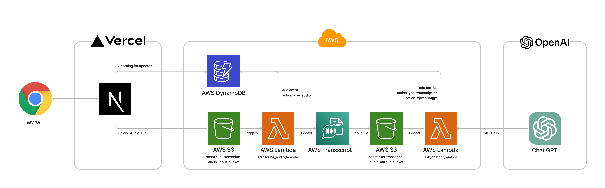

# Audio-Assistant

Your AI Assistant: Knowledge instantly accessible. Ask your question to the AI assistant by recording your voice, send it, and you receive an answer directly.

https://assistant.xtra.tools

## Architecture

The architecture is based on the AWS Cloud and the OpenAI API where the UI is implemented with React and Next.js deployed on Vercel.


## Environment Variables

This environment variables are needed for the use of the **AWS Services** and the **OpenAI API**.

```bash
export AWS_ACCESS_KEY_ID=
export AWS_SECRET_ACCESS_KEY=
export AWS_BUCKET_NAME=
export AWS_REGION=
export OPENAI_API_KEY=
export OPENAI_ORG_ID=
# Terraform variables redefined with TF prefix
export TF_VAR_AWS_ACCESS_KEY_ID=$AWS_ACCESS_KEY_ID
export TF_VAR_AWS_SECRET_ACCESS_KEY=$AWS_SECRET_ACCESS_KEY
export TF_VAR_OPENAI_API_KEY=$OPENAI_API_KEY
export TF_VAR_OPENAI_ORG_ID=$OPENAI_ORG_ID
```

You can set them in your local .zshrc or .bashrc file or in the codespaces settings or where ever your environment needs them to be setup.

## DynamoDB Schema

The actionVersion contains a static String = "1.0"

Table name: assistent.one

- userID (Partition key) :String
- actionUpdated (Sort key) :String
- actionResult :String
- actionType :String
- actionUuid :String
- actionVersion :String
- isDeleted :Boolean
- transcriptionJobName :String
